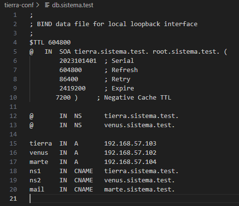
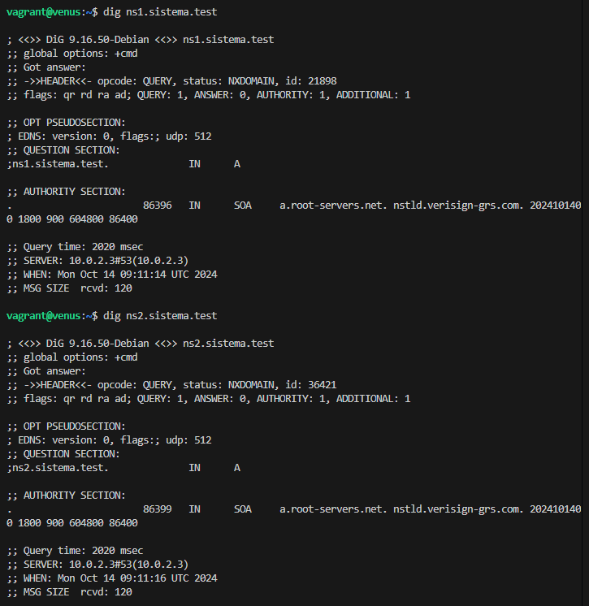

# Practica_master_slave
Repositorio para la práctica de despliegue de aplicaciones web.

1. Inicializamos el archivo Vagrantfile con `vagrant init`.
2. Configuramos los equipos según el ejercicio 2. Los equipos utilizarán boxes de vagrant, en concreto bullseye64. A cada máquina le asignamos un hostname, una IP fija y una provisión donde actualizamos la VM e instalamos las herramientas para usar DNS.

3. Configuramos el named.conf.options de la VM Tierra para que:
    1. No escuche a las direcciones ipv6.
    2. Permita consultas dentro de su misma red.
    3. Permita las consultas recursivas.
    4. Activar DNSSEC
    5.  Asignar la dirección 208.67.222.222 para los reenvíos de consultas.
    
    

4. Configuramos named.conf.local y le damos autoridad sobre la zona directa e inversa.

5. Creamos y configuramos db.sistema.test y db.192 asignando así una configuración de las zonas en cada archivo. En estas configuracione asignamos puertos para las distintas conexiones.

6. Una vez realizadas dichas configuraciones podemos pasar a la configuración del DNS de Venus.
Realizamos los cambios en el conf.local de venus para la zona directa e inversa.

7. Con todos los documentos editados correctamente, modificamos la provisión de cada VM para que introduzca los archivos pertinentes al directorio que les corresponde para que el sistema sea replicable en otros equipos.
    Para ello incluímos varias líneas de código en las provisiones.

8. Realizamos las comprobaciones planteadas en la práctica para asegurarnos de que hemos configurado correctamente la máquina.

RECOMENDACIONES PARA LA INSTALACIÓN:
sudo apt-get update para ambas máquinas.
vagrant reload --provision para asegurarnos de que la provisión está instalada.